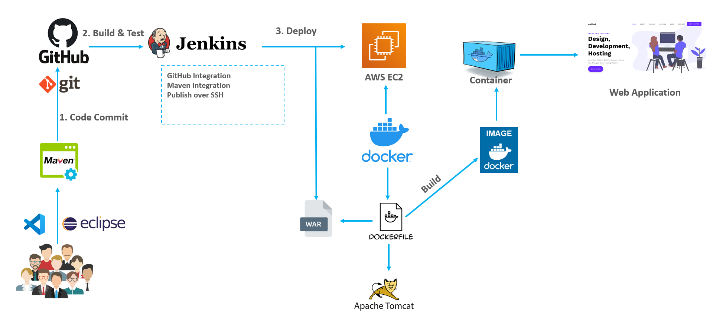

# DevOps with Git, Jenkins & Docker on AWS EC2




1. Launch an EC2 instance for Docker host 

2. Install docker on EC2 instance & start services  
  ```sh 
    yum install docker
    service docker start
  ```

3. create a new user for Docker management and add him to Docker (default) group
```sh
  useradd dockeradmin
  passwd dockeradmin
  usermod -aG docker dockeradmin
  ```
  
4. Write a Docker file under /opt/docker

 ```sh
   mkdir /opt/docker
 ``` 
   Allow user - dockeradmin to acess /opt/docker
 ```sh
    chown -R dockeradmin:dockeradmin /opt/docker
 ```
```sh
  ## nano Dockerfile
  
  # Pull base image 
  From tomcat:8-jre8 

  # Maintainer
  MAINTAINER "Mohan" 

  # copy war file on to container 
  COPY ./webapp.war /usr/local/tomcat/webapps
```

5. Login to Jenkins console and add Docker server to execute commands from Jenkins  
    Manage Jenkins --> Configure system -->  Publish over SSH --> add Docker server and credentials

6. Create Jenkins job 

    A) Source Code Management  
     Repository : https://github.com/mohan-balakrishnan/Devops_cicd.git  
     Branches to build : */master  

    B) Build
     Root POM: pom.xml  
     Goals and options : clean install package  

    C) send files or execute commands over SSH
     Name: docker_host  
     Source files	: `webapp/target/*.war`
     Remove prefix	: `webapp/target`
     Remote directory	: `//opt//docker`  
     Exec command[s]	: 
  ```sh
    docker stop myapp; docker rm -f myapp; docker image rm -f myapp; cd /opt/docker; docker build -t myapp .
  ```
    D) send files or execute commands over SSH  
      Name: `docker_host`  
      Exec command	: docker run -d --name myapp -p 80:8080 myapp

7. Login to Docker host and check images and containers. (no images and containers)

8. Execute Jenkins job

9. check images and containers again on Docker host. This time an image and container get creates through Jenkins job

10. Access web application from browser which is running on container
```
    <docker_host_Public_IP>/webapp
```

------------------------------------------------------------------------------------------------------------------------------------------------------------------------------

If you have user permission issues in EC2 instance while configuring in jenkins publish over ssh.

Go to the path: ```nano /etc/ssh/sshd_config```
```
  Comment Out: PasswordAuthentication no
  Uncomment: PasswordAuthentication yes 
 ````
 ```
example:

 #To disable tunneled clear text passwords, change to no here!
 PasswordAuthentication yes
 #PasswordAuthentication no
 ```

Run command to restart sshd :
```
service sshd restart

```
